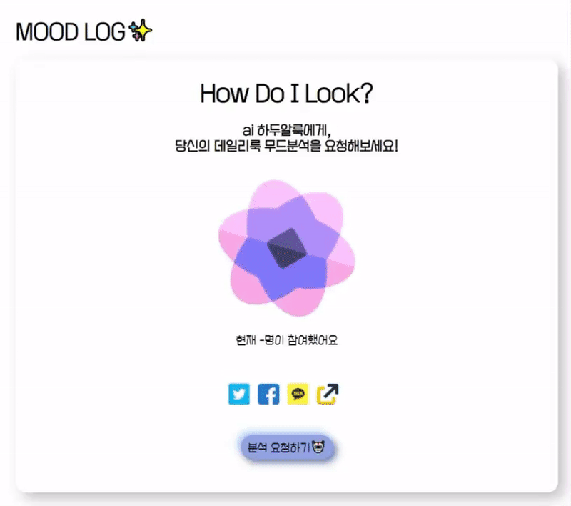

# MOOD LOG✨

ai가 알려주는 데일리룩 무드. 매일 달라지는 아웃핏에 따른 무드를 분석할 수 있는 웹사이트를 구현.   
mbti, 심리테스트 등 공유 놀이 문화를 반영, 1회성 테스트 특성을 개선한 데일리 무드 분석 서비스.

# 목차

- [설계](#설계)
- [기능](#기능)
- [구현](#구현)
- [트러블슈팅](#트러블슈팅)

---

# 1️⃣ 설계

## 목표
- react와 typescript를 활용한 분석 및 테스트형 웹사이트 제작
- 반응형 구현
- 이미지 업로드 및 처리 구현

## 레이아웃

- 구성 : 홈(완료) - 업로드 페이지(완료) - 결과 페이지(공사중)
  

---

# 1️⃣ 기능

## 소셜미디어 공유

- 트위터, 페이스북, 인스타그램 공유
- 카카오톡 api 활용한 공유
- 링크 복사

## 사진 업로드 및 처리

- 🌱

## 결과페이지
### 사용자별 다른 결과페이지 제공
- 🌱

### 결과값 시각화
- 🌱(차트 사용)

---

# 2️⃣ 구현

- 🌱

---

# 3️⃣ 트러블슈팅

## json, form데이터 전송 오류
### 문제

- `input` 태그에 입력된 이미지 파일을 전송하는데 문제를 겪음.
- "Content-Type": "application/json"
- 폼태그에 encType="multipart/form-data”
- State 사용해 파일 받음
- FormData() 객체 생성 없이 JSON.stringify에 body 담음

### 수정

```js
// /src/components/Upload.tsx
const url: string = "전송할url";
  const now = Date.now();
  const [file, setFile] = useState("");

  const onLoadFile = (e: any) => {
    const file = e.target.files[0];
    //console.log(file);
    setFile(file);
    console.log(file);
  };

const handleSubmit = (e: any) => {
    e.preventDefault();
    console.log(file);

    let formData = new FormData();
    formData.append("files", file);

    const dataSet = {
      id: now,
    };
    formData.append("data", JSON.stringify(dataSet));

    fetch(url, {
      method: "POST",
      headers: {
        "Content-Type": "application/json",
      },
      body: formData,
    });
  };

return(
  <form onSubmit={handleSubmit} encType="multipart/form-data">
        <input id="file" type="file" name="file" onChange={onLoadFile} />
        <div>
          <button type="submit" className="button">
            ai에게 사진 보내기🤖
          </button>
        </div>
      </form>
)
```
- State로 파일을 담은 뒤 formData()의 객체에 append하는 방식으로 변경


## 수정 중
- 개별 사용자에게 다른 output페이지가 나타나야함
- formData전송 및 submit 시 url에 파라미터로 id값을 전송하는 등의 방법 공부 중
- 공유 기능 수정
    - 카카오톡 공유 시 페이지가 나타나지 않음
    - 인스타그램 공유기능 추가 
- 결과 페이지 재구성
